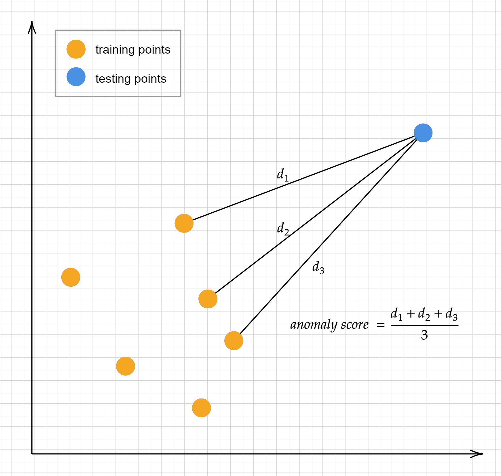

# Anomaly Detection Algorithms

Implementations of the k-Nearest Neighbors (KNN) and AutoRegression (AutoReg) algorithms for anomaly detection on tabular and time-series data, respectively.

# KNN

# AutoReg

