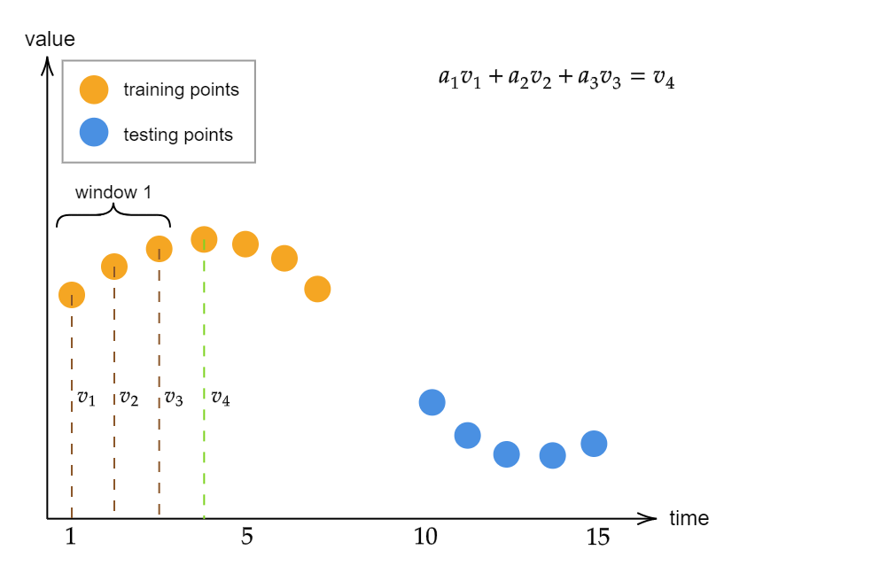

# Anomaly Detection Algorithms

Implementations of the $k$-Nearest Neighbors and AutoRegression
algorithms for anomaly detection (AD) on tabular and time-series data,
respectively.

# What is Unsupervised AD?

Given a training set $D$ of $m$ vectors in $\mathbb{R}^n$, a contamination
hyperparameter $c \in [0, 0.5)$, and a testing set $D'$ of $m'$ vectors in
$\mathbb{R}^n$, an unsupervised AD algorithm $\mathcal{A}(D \mid D', c)$ will
classify each vector $\mathbf{d_i'} \in D'$ as normal or anomalous as follows:

1. Let $f_\mathcal{A} \colon \mathbb{R}^n \to \mathbb{R}$ map an $n$-dimensional
vector $\mathbf{v}$ to its corresponding anomaly score, which is an
algorithm-specific scalar that quantifies "how anomalous" $\mathbf{v}$ is.
2. Let $\mathbf{d_i} \in D$. Compute a vector of training anomaly scores,
$\mathbf{s} \in \mathbb{R}^m$, where the $i\text{th}$ component of $\mathbf{s}$
is equal to $f_\mathcal{A}(\mathbf{d_i})$.
3. Compute a vector $\mathbf{s_{max}}$ which contains the
${\lceil c \cdot m \rceil}$ highest anomaly scores in $\mathbf{s}$.
4. Define the threshold score, $s_t$, as the minimal anomaly score in
$\mathbf{s_{max}}$.
5. Using $s_t$, any $\mathbf{d_i'} \in D'$ such that
$f_\mathcal{A}(\mathbf{d_i'}) \geq s_t$ will be classified as anomalous, and any
$\mathbf{d_i'}$ such that $f_\mathcal{A}(\mathbf{d_i'}) < s_t$ will be
classified as normal.

# $k$-Nearest Neighbors (KNN) for AD

Within the context of anomaly detection, the KNN algorithm defines its anomaly
score function $f_\mathcal{A}$ as the arithmetic mean of the $k$ shortest
Euclidean distances from an input vector $\mathbf{v}$. In other words, if we let
$B$ be a set containing the $k$ training vectors from $D$ which are closest
to $v$, then we may formally define $f_\mathcal{A}$ as follows:

$$
    f_\mathcal{A}(\mathbf{v}) = \dfrac{\sum\limits^k_{i=0} \left| \mathbf{v} - B_i \right|}{k}
$$

The following visualization in $\mathbb{R}^2$, where $k=3$, elucidates the fact
that points close to the most training vectors will have a small anomaly score,
whereas points further from most training vectors will have a larger anomaly
score.

# AutoRegression (AutoReg) for AD

The AutoRegression algorithm is a variant of the traditional linear regression
model for tabular datasets, but extended to operate on time-series data.

## Theoretical background

The following mathematical formalization represents the necessary steps that are
executed by the AutoReg algorithm when performing anomaly detection on a
time-series dataset.

**1.** Given an ordered collection of real-valued, consecutive, and univariate time-series training data $X_1, X_2, \dots, X_n$ and a window-length hyperparameter $p$, compute an $(n - p) \times (p + 1)$ matrix, $D$, of the following form:

$$
    D = 
    \begin{bmatrix}
        \mathbf{x_{p + 1}} \\
        \mathbf{x_{p + 2}} \\
        \vdots \\
        \mathbf{x_{n}}
    \end{bmatrix}
    =
    \begin{bmatrix}
        X_1 & X_2 & \dots & X_p & 1 \\
        X_2 & X_3 & \dots & X_{p + 1} & 1 \\
        \vdots & \vdots & \ddots & \vdots & \vdots \\
        X_{n - p} & X_{n - p + 1} & \dots & X_{n - 1} & 1
    \end{bmatrix}
$$

- Each $p$-dimensional row vector $\mathbf{x_j}$ of the above matrix represents a window of length $p$, which will be used to predict the next value in the time-series, $X_{j}$, according to the following formula, where $a_i$ represents the ith least-squares regression coefficient, $c$ is the bias term, and $\epsilon_t$ represents the error term for the time-series point $X_t$:

$$
    X_t = \left(\sum_{i=1}^p a_i \cdot X_{t - i}\right) + c + \epsilon_t
$$

- Note the general form of each row vector $\mathbf{x_j}$ (this will be helpful for step 4):

$$
    \mathbf{x_j} = 
    \begin{bmatrix}
        X_{j - p} & X_{j - p + 1} & \dots & X_{j - 1} & 1 
    \end{bmatrix}
$$

- The absolute value of the error term, $|\epsilon_t|$, represents the anomaly score for $X_t$.

**2.** Compute an $(n - p)$-dimensional column vector, $\mathbf{\overline{y}}$, of the following form:

$$
    \mathbf{\overline{y}} = 
    \begin{bmatrix}
        X_{p + 1} \\
        X_{p + 2} \\
        \vdots \\
        X_{n}
    \end{bmatrix}
$$

**3.** Compute regression coefficients $a_1, a_2, \dots, a_p$ and the bias term $c$ using least squares regression in accordance with the analytical solution:

$$
    \mathbf{a} = 
    \begin{bmatrix}
        a_{p} \\
        a_{p - 1} \\
        \vdots \\
        a_{1} \\
        c
    \end{bmatrix}
    = (D^{\mathsf{T}} D)^{-1} D^{\mathsf{T}} \mathbf{\overline{y}}
$$

**4.** Compute each error term $\epsilon_t$ corresponding to $X_t$ according to the following formula:

$$
    \begin{align*}
        \epsilon_t &= X_t - \left(\left(\sum_{i=1}^p a_i \cdot X_{t - i}\right) + c\right) \\
        &= X_t - 
        \begin{bmatrix}
            a_{p} \\
            a_{p - 1} \\
            \vdots \\
            a_{1} \\
            c
        \end{bmatrix}
        \cdot
        \begin{bmatrix}
            X_{t - p} \\
            X_{t - p + 1} \\
            \vdots \\
            X_{t - 1} \\
            1
        \end{bmatrix} \\
        &= X_t - \mathbf{a} \cdot \mathbf{x_t}
    \end{align*}
$$

- Conveniently, all $\epsilon_t$ values may be computed at once using matrix multiplication, as shown below:

$$
    \begin{align*}
        \boldsymbol{\epsilon} &=
        \begin{bmatrix}
            \epsilon_{p + 1} \\
            \epsilon_{p + 2} \\
            \vdots \\
            \epsilon_{n}
        \end{bmatrix} \\
        &= 
        \begin{bmatrix}
            X_{p + 1} - \mathbf{x_{p + 1}} \cdot \mathbf{a} \\
            X_{p + 2} - \mathbf{x_{p + 2}} \cdot \mathbf{a} \\
            \vdots \\
            X_{n} - \mathbf{x_{n}} \cdot \mathbf{a}
        \end{bmatrix} \\
        &= \mathbf{\overline{y}} - D\mathbf{a}
    \end{align*}
$$

- Note that $\boldsymbol{\epsilon}$ is an $(n - p)$-dimensional column vector, implying that the first $p$ points are not able to be assigned anomaly scores (as they lack the previous context necessary for calculating the anomaly score).

**5.** Let $d$ be a hyperparameter in the range $(0, 1)$ corresponding to the percent of data points that should be considered anomalies. Define a list $\mathbf{x_d}$ which contains the $\lceil d \cdot n \rceil$ highest anomaly scores of the training data points. Define the threshold anomaly score, $|\epsilon_d|$, as the minimal anomaly score in $\mathbf{x_d}$. Using $|\epsilon_d|$, points with an anomaly score greater than or equal to $|\epsilon_d|$ will be classified as anomalous, and points with a lower anomaly score will be classified as normal.

**6.** Given an ordered collection of real-valued, consecutive, and univariate time-series testing data $X_1', X_2', \dots, X_m'$, where $m > p$, predict whether each testing point $X_i'$, where $p < i \leq m$, is anomalous or normal according to the following procedure:

- Compute an $(m - p) \times (p + 1)$ matrix, $D'$, of the following form:

$$
    D' = 
    \begin{bmatrix}
        \mathbf{x_{p + 1}'} \\
        \mathbf{x_{p + 2}'} \\
        \vdots \\
        \mathbf{x_{n}'}
    \end{bmatrix}
    =
    \begin{bmatrix}
        X_1' & X_2' & \dots & X_p' & 1 \\
        X_2' & X_3' & \dots & X_{p + 1}' & 1 \\
        \vdots & \vdots & \ddots & \vdots & \vdots \\
        X_{m - p}' & X_{m - p + 1}' & \dots & X_{m - 1}' & 1
    \end{bmatrix}
$$

- Compute an $(m - p)$-dimensional column vector, $\mathbf{\overline{y}'}$, of the following form:

$$
    \mathbf{\overline{y}'} = 
    \begin{bmatrix}
        X_{p + 1}' \\
        X_{p + 2}' \\
        \vdots \\
        X_{m}'
    \end{bmatrix}
$$

- Compute an $(m - p)$-dimensional column vector of error terms, $\boldsymbol{\epsilon'}$, using matrix multiplication of $D'$ with the regression coefficients:

$$
    \boldsymbol{\epsilon'} = 
    \begin{bmatrix}
            \epsilon_{p + 1}' \\
            \epsilon_{p + 2}' \\
            \vdots \\
            \epsilon_{m}'
        \end{bmatrix}
    = \mathbf{\overline{y}'} - D'\mathbf{a}
$$

- For each testing point $X_i'$ where $p < i \leq m$, compare the corresponding anomaly score $|\epsilon_i'|$ with $|\epsilon_d|$. If $|\epsilon_i'|$ is greater than or equal to $|\epsilon_d|$, classify $X_i'$ as anomalous. Otherwise, classify $X_i'$ as normal.

## Visualization

The below animation visually demonstrates each of the six steps previously
outlined for a small example of univariate time-series data.

